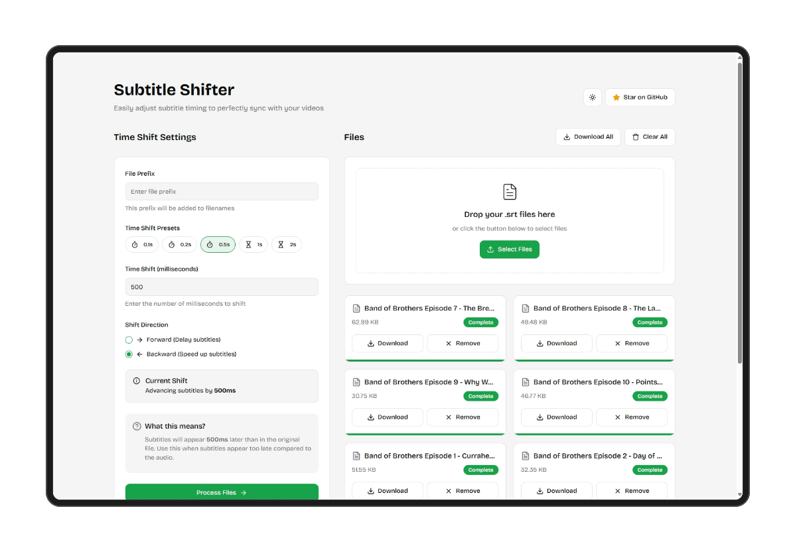

## Subtitle Time Offsetter

A simple web app that helps you adjust the timing of SRT subtitle files, making it easy to sync subtitles perfectly with your videos. built with Next.js, TypeScript, and Tailwind CSS.



### Features

- Adjust subtitle timestamps forward or backward with ease.
- Process multiple subtitle files at once.
- Download individual files or all as a ZIP.
- Toggle between light and dark themes.
- Upload files via drag-and-drop or file selection.
- All processing done in client-side, no server-side code.

### Getting Started

#### Prerequisites

- Node.js
- pnpm (optional)

#### Installation

1. Clone the repository:

   ```bash
   git clone https://github.com/hdytrfli/subtitle-shifter.git
   cd subtitle-shifter
   ```

2. Install dependencies:

   ```bash
   pnpm install
   ```

3. Run the development server:

   ```bash
   pnpm dev
   ```

4. Open [http://localhost:3000](http://localhost:3000) in your browser to see the app.

#### Building for Production

```bash
pnpm build
pnpm start
```

### How to Use

1. **Upload SRT Files**: Drag and drop your .srt files or click to select files.
2. **Configure Shift Settings**: Set the time shift amount, direction (forward or backward), and a file prefix.
3. **Process Files**: Click "Process Files" and track progress.
4. **Download Results**: Download individual files or a ZIP archive with all processed files.

### License

[MIT License](LICENSE)

### Contributing

Contributions are welcome! Feel free to fork the repository and submit a pull request.
